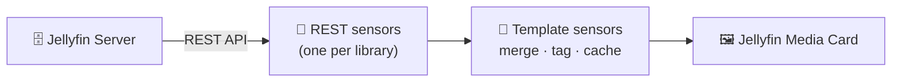

<div align="center">

# 📺 Jellyfin Media Card — Sensors

**The Home Assistant sensors that feed the [Jellyfin Media Card](https://github.com/a4happy20/jellyfin-media-card).**

They pull *Recently Added* and *Next Up* items from your Jellyfin server, tag each item by
library, cache the last good result, and expose it all as tidy template sensors the card can read.

[](LICENSE)
[](https://www.home-assistant.io/docs/configuration/packages/)
[](https://api.jellyfin.org/)

</div>

---

> [!IMPORTANT]
> **This is a Home Assistant configuration _package_ — not an integration and not a HACS add-on.**
> You don't install it through HACS. You copy some YAML into your own configuration and (optionally)
> turn on Home Assistant's packages feature.
> 👉 [Configuration packages — Home Assistant docs](https://www.home-assistant.io/docs/configuration/packages/)

<br>

## Contents

- [What is this?](#what-is-this)
- [How it works](#how-it-works)
- [Prerequisites](#prerequisites)
- [Setup](#setup)
  - [Step 0 — Enable packages *(optional)*](#step-0--enable-packages-optional)
  - [Step 1 — Add the package file](#step-1--add-the-package-file)
  - [Step 2 — Add your secrets](#step-2--add-your-secrets)
  - [Step 3 — Point the template at your server](#step-3--point-the-template-at-your-server)
  - [Step 4 — Add your libraries](#step-4--add-your-libraries)
  - [Step 5 — Exclude from Recorder *(optional)*](#step-5--exclude-from-recorder-optional)
  - [Step 6 — Check config & restart](#step-6--check-config--restart)
- [The data the card receives](#the-data-the-card-receives)
- [Using it with the card](#using-it-with-the-card)
- [Troubleshooting](#troubleshooting)
- [License](#license)

<br>

## What is this?

Two [trigger-based template sensors](https://www.home-assistant.io/integrations/template/)
that read from one or more REST sensors and hand the card a clean, ready-to-display list.

| Sensor entity | Pulls from | What it shows |
|---|---|---|
| `sensor.jellyfin_recent_card_data` | one REST sensor **per library** | Recently added episodes, merged and tagged by library |
| `sensor.jellyfin_next_up_card_data` | Jellyfin `Shows/NextUp` | Your Jellyfin user's **Next Up** queue |

Each sensor's `episodes` attribute is a list shaped exactly the way the card expects. In the card,
just point the `entity` option at whichever sensor you want to display.

<br>

## How it works

You're wiring up a short chain. Data flows left to right:



- **REST sensors** do the fetching — one per Jellyfin library you want to show, plus one for *Next Up*.
- **Template sensors** merge those results, tag each episode with its library name, and keep the last
  good list if a fetch briefly comes back empty (that's the caching).
- **The card** reads the template sensor and renders it.

Once you understand these three pieces, the setup steps below map cleanly onto them.

<br>

## Prerequisites

- A running **Jellyfin server** reachable from Home Assistant.
- A **Jellyfin API key** and your **user ID**.
- The **ParentId** of each library you want to display.
- *(Optional but expected)* the [Jellyfin Media Card](https://github.com/a4happy20/jellyfin-media-card)
  installed, so there's something to render the data.

Here's where to grab each value from your Jellyfin dashboard:

| Value | What it's for | Where to find it |
|---|---|---|
| **API key** | Lets Home Assistant talk to Jellyfin | Dashboard → **Advanced** → **API Keys** |
| **User ID** (`<UID>`) | Whose library / Next Up queue to read | Dashboard → **Users** → click your user → copy the ID from the browser URL |
| **Library ParentId** (`<LIB_ID>`) | Which library to monitor | Open a library in Jellyfin → copy the `id` from the browser URL |

<br>

## Setup

**The whole process in a nutshell:**

1. Drop the package file into Home Assistant.
2. Put your API key, user ID, and library URLs in `secrets.yaml`.
3. Replace the placeholder Jellyfin address in the template.
4. Tell the sensors which libraries to watch.
5. *(Optional)* Keep the sensors out of Recorder.
6. Check the config and restart.

Each step is spelled out below. 👇

<br>

### Step 0 — Enable packages *(optional)*

<details>
<summary><b>Show me how to enable packages</b></summary>

<br>

> 📖 Reference: [Configuration packages — Home Assistant docs](https://www.home-assistant.io/docs/configuration/packages/)

In your `configuration.yaml`, tell Home Assistant to load a `packages` folder:

```yaml
homeassistant:
  packages: !include_dir_named packages
```

Then create the folder and file at `config/packages/jellyfin_media_card_sensors.yaml`.
*(If you already have a `homeassistant:` block, just add the `packages:` line under it.)*

**Or**, skip the folder and include this one file directly:

```yaml
homeassistant:
  packages:
    jellyfin_media_card_sensors: !include jellyfin_media_card_sensors.yaml
```

</details>

> [!TIP]
> Don't want to use packages at all? That's fine. Just place the **REST sensors** and
> **template sensors** wherever they normally live in your configuration.

<br>

### Step 1 — Add the package file

Copy `jellyfin_media_card_sensors.yaml` into `config/packages/`.

<br>

### Step 2 — Add your secrets

Open your `secrets.yaml` and add the three entries below, replacing the placeholders with your own values:

```yaml
jellyfin_auth_header: 'MediaBrowser Token="YOURKEY"'

jellyfin_nextup_url: "http://YOUR_JELLYFIN_HOST:8096/Shows/NextUp?userId=<UID>&Limit=10&Fields=Overview,LocationType,Path,SeriesId,DateCreated,ParentIndexNumber,IndexNumber&EnableImages=true"

jellyfin_recent_library: "http://YOUR_JELLYFIN_HOST:8096/Users/<UID>/Items?ParentId=<LIB_ID>&IncludeItemTypes=Episode&Recursive=true&SortBy=DateCreated&SortOrder=Descending&Fields=Overview,LocationType,Path,SeriesId,PremiereDate&Limit=3"
```

**What to swap out:**

| Placeholder | Replace with |
|---|---|
| `YOURKEY` | Your Jellyfin API key |
| `YOUR_JELLYFIN_HOST:8096` | Your Jellyfin address and port |
| `<UID>` | Your Jellyfin user ID |
| `<LIB_ID>` | The ParentId of the library |
| `Limit=3` / `Limit=10` | How many items each sensor should return |

> [!TIP]
> Want a different feed (e.g. *Resume/Continue Watching*)? You can build your own URLs from the
> [Jellyfin API reference](https://api.jellyfin.org/#tag/Library/operation/GetResumeItems) and drop
> them into `secrets.yaml` the same way.

<br>

### Step 3 — Point the template at your server

Inside `jellyfin_media_card_sensors.yaml`, the template sensors build image URLs with a hard-coded
base address. Replace `http://YOUR_JELLYFIN_HOST:8096` with your real Jellyfin address in **both
places** it appears:

```yaml

```

> [!NOTE]
> This address lives in the template instead of `secrets.yaml` because `!secret` can't be resolved
> **inside** a Jinja template string. So it has to be typed here directly.

<br>

### Step 4 — Add your libraries

Now tell the sensors which libraries to watch. There are **three spots** to keep in sync — one library
= one entry in each.

**a) The REST sensor** — one block per library, each pointing at its own secret:

<details>
<summary><b>Show the REST sensor block</b> (this is a snippet — see the full file for the complete sensor)</summary>

<br>

```yaml
rest:
  - resource: !secret jellyfin_recent_library     # your library URL secret
    scan_interval: 300
    headers:
      Authorization: !secret jellyfin_auth_header
    sensor:
      - name: "Jellyfin Recent Library"           # sensor name
        unique_id: jellyfin_recent_library        # sensor id
        value_template: >
          {{ (value_json.Items | default([])
              | selectattr('LocationType','eq','FileSystem') | list | length)
             if value_json is defined else 0 }}
        json_attributes:
          - Items
```

</details>

**b) The template sensor's `trigger` list** — so it re-runs when any library sensor updates:

<details>
<summary><b>Show the trigger block</b></summary>

<br>

```yaml
template:
  - trigger:
      - trigger: state
        entity_id:
          - sensor.jellyfin_recent_library        # your library REST sensor
          - sensor.jellyfin_recent_library_2      # additional library
          - sensor.jellyfin_recent_library_3      # additional library
      - trigger: homeassistant
        event: start
```

</details>

**c) The template sensor's `sources` list** — pairs each REST sensor with a library name:

<details>
<summary><b>Show the sources block</b></summary>

<br>

```yaml
{# --- source libraries: entity + library key. Edit to add/remove. --- #}

```

</details>

> [!TIP]
> The **name** in the `sources` list (`library`, `library2`, …) is what the Jellyfin Media Card reads
> when you set `art_overrides`. Pick names that make sense to you.

<br>

### Step 5 — Exclude from Recorder *(optional)*

These sensors can carry a lot of data. With a high `Limit`, Recorder may log warnings about the volume.
If so, exclude them:

```yaml
recorder:
  exclude:
    entities:
      - sensor.jellyfin_next_up
      - sensor.jellyfin_recent_library
      - sensor.jellyfin_recent_library_2
      - sensor.jellyfin_recent_library_3
      - sensor.jellyfin_recent_card_data
      - sensor.jellyfin_library_card_data
      - sensor.jellyfin_next_up_card_data
```

<br>

### Step 6 — Check config & restart

Go to **Developer Tools → YAML → Check Configuration**, fix anything it flags, then **restart Home
Assistant**. On startup the sensors populate, and the caching logic holds onto the last good list if a
fetch briefly returns nothing.

<br>

## The data the card receives

Each sensor's `episodes` attribute is a list of items shaped like this — one object per episode:

```jsonc
[
  {
    "id": "episode_id",
    "series": "Series Name",
    "season": 1,
    "episode": 1,
    "title": "Episode Name",
    "overview": "Episode description",
    "library": "Library Name (set in the sensor)",
    "added": "Date added",
    "episode_art": "URL to the episode's art",
    "series_art": "URL to the series' poster art"
  }
]
```

You don't build this by hand — the sensors produce it. It's shown here just so you know what the card
is working with.

<br>

## Using it with the card

Once `sensor.jellyfin_recent_card_data` exists, add it to a card on your dashboard:

```yaml
type: custom:jellyfin-media-card
entity: sensor.jellyfin_recent_card_data   # or sensor.jellyfin_next_up_card_data
```

Every card option is documented in the
[Jellyfin Media Card README](https://github.com/a4happy20/jellyfin-media-card).

<br>

## Troubleshooting

<details>
<summary><b>Config check fails</b></summary>

<br>

YAML is whitespace-sensitive — indentation errors are the usual culprit. Read the exact line
**Check Configuration** points to, and make sure you're using spaces (not tabs).
</details>

<details>
<summary><b>Sensor is <code>unavailable</code> or stuck at 0</b></summary>

<br>

Check that your `secrets.yaml` values are correct — API key, user ID, and library ParentId — and that
Home Assistant can actually reach your Jellyfin address. Try opening one of the URLs from `secrets.yaml`
in a browser to confirm it returns data.
</details>

<details>
<summary><b>Images/artwork won't load</b></summary>

<br>

Make sure you replaced `http://YOUR_JELLYFIN_HOST:8096` in **both** places in Step 3, and that the
address is reachable from the device viewing the dashboard.
</details>

<details>
<summary><b>Recorder warnings about data size</b></summary>

<br>

Lower the `Limit` in your URLs, or exclude the sensors from Recorder (see [Step 5](#step-5--exclude-from-recorder-optional)).
</details>

<br>

## License

Licensed under the [GNU General Public License v3.0](LICENSE).
